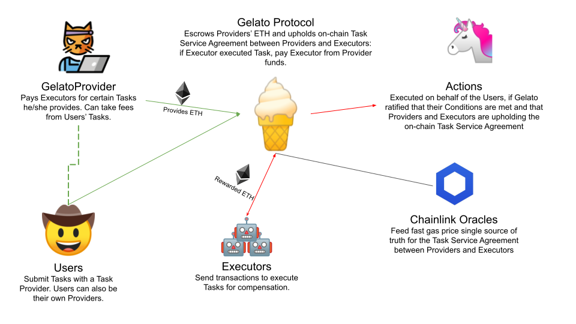

<h1  align="center">Gelato - The easiest way to build automated Ethereum dapps</h1>

---

## Get Started 🍦

- 🍦 Read our Gelato-V1 release announcement on our [blog]
- 🍦 Try out our demo tutorial [here](https://github.com/gelatodigital/Gelato-kyber){:target="_blank"}
- 🍦 Create your own Task (advanced) [here](src/demo/README.md)
- 🍦 Soon we will publish Developer Documentation. Bare with us!
- 🍦 Read the [Gelato Audit report](docs/audits/G0Group-Gelato2020Jun.pdf)

## Who is Gelato for? 🍦

Developers on Ethereum, who want to build automation into their dapps, without having to worry about:

- Running the required underlying relay node infrastructure themselves
- Trusting a single operator to run the relay node infrastructure for them

If you as a developer want to leverage Gelato automation, all you need to know is Javascript or Solidity or both, depending on what you want to build or customize.

## What is Gelato ? 🍦
>Gelato is a tool for developers to automate smart contract execution on Ethereum.

Gelato is a tool to build automation into dapps and thus level them up to a whole new range of cool features and User Experiences. Think of Gelato as the infrastructure that enables you to make use of automated `If This, Then That` execution for smart contracts. It allows for the combination of arbitrary [Conditions](https://github.com/gelatodigital/Gelato-kyber/tree/master/contracts/gelato_conditions) with arbitrary [Actions](https://github.com/gelatodigital/Gelato-kyber/tree/master/contracts/gelato_actions), which will be executed on behalf of your Users by a network of relay nodes called "Executors".

## What is an automated dapp? 🍦

🍦**Example #1:** Swap 100 DAI to ETH on Uniswap every week. (check out the Gelato [demo tutorial](https://github.com/gelatodigital/Gelato-kyber){:target="_blank"} for a similar use case)

🍦**Example #2:** Automatically refinance my loan between multiple lending protocols to always get the highest yield.

🍦**Example #3:** Automatically buy ETH when its price dropped and then sell it again after the price has gone up again (automatic volatility trader).

A **regular dapp** like [uniswap.exchange](https://app.uniswap.org/#/swap){:target="_blank"} requires Users to interact with it manually by sending transactions every time they want to swap tokens. Users that want to sell 100 DAI every week on Uniswap have to manually do it every week.

An **automated dapp**, using Gelato, requires Users to only send a transaction once and then will keep on sending the ensuing transactions on the Users' behalves in the future, when, and only if, the User-defined Conditions are met. That's why, with Gelato integrated, Users that want to sell 100 DAI every week on Uniswap only have to send one initialization transaction for their 100 DAI to be automatically sold from then onward.

# How Gelato works

At its core, Gelato is a network of relay nodes **(executors),** which User's can instruct to submit arbitrary transactions **(Actions)** on their behalf, when certain predefined **Conditions** are met.

The only thing Executors demand before executing a transaction is to be rewarded, or at least compensated, for their gas costs. Therefore, Users have to deposit some ETH on the GelatoCore smart contract, which can be seen as "filling up their gas tank". Now if an Executor executes a transaction, the costs of the execution will be automatically deducted from the User's ETH balance on Gelato, similar to other pay-as-you-go services. Gelato uses Chainlink gas price oracles, to regulate the gas price Executors are allowed to use, and thus to ensure fair market rates.

Everyone can access the Executors' services by submitting arbitrary Tasks to them, which they will execute exactly as per the User's specification. Executors never have custody of Users funds, they simply initiate the transaction. Funds are always kept either in the User's wallet or in their personal smart contract wallet (proxy contract).

Therefore, in order to enable your Users to let Gelato submit transactions on their behalf in the future, someone simply has to deposit some ETH to pay the Executors on Gelato and you are good to go. This **someone** actually does not necessarily have to be the User himself, it can also be the developers (called **GelatoProvider**), who want to offer their Users a smoother UX on their dApp. Namely, a UX that does not require the User to pre-deposit ETH on Gelato and to worry about gas-tank balance top-ups during high gas price volatility.

## GelatoProviders

GelatoProviders deposit ETH on Gelato, in order to pay for their Users' automated transactions. In most cases, GelatoProviders are dapp developers that want to offer cool automated dapps to their customers, without requiring them to prepay ETH and worry about maintaining a high enough balance for Executors during times of gas price volatility.

GelatoProviders have the ability to define exactly what kind of automation **Tasks** they provide to Users, so that GelatoProviders control the business logic of the Tasks they pay for. They can define:

1. The Spec of the Task, or in other words, what kind of Conditions are allowed in combination with what kind of Actions

2. The maximum execution gas price for any Task Spec they whitelist.

3. They can define much more on their "GelatoProviderModule". Notably, what type of Users, or rather User smart contract proxy accounts, they allow to tap into the GelatoProvider funds, to pay for transaction automation.

#### Why would a GelatoProvider pay for their Users transaction fees on Gelato?

While developers can certainly build Dapps with Gelato that require their end-users to maintain a gas tank balance, to pay for automation gas, having to ask end-users to deposit some ETH on Gelato before their transactions get executed still sounded like bad UX to us. Especially because end-users would have to make accurate predictions about future gas prices, in order to have some degree of certainty that they will still have enough funds deposited on Gelato, in order to pay Executors when the time has come. That's why we introduced the concept of **GelatoProviders**, who can abstract this complexity for the end-users.

In short, GelatoProviders are incentivised to pay for their Users automated transactions because they can provide great UX this way. Additionally, they have many opportunities to create interesting business models on top of Gelato. For example, if a GelatoProvider enables Users to swap DAI to ETH on Uniswap every 2 days, then an automated GelatoProvider fee mechanism could be applied for each executed transaction, which retains 0.5% of the sold tokens and sends them to the GelatoProvider.

This way, on the one hand Users do not have to prepay ETH on Gelato, and on the other hand  GelatoProviders get rewarded, or at least compensated, for paying the transaction fees on behalf of Users, all without having to do the heavy lifting of running the underlying infrastructure.

Hence you can think of Gelato as a pay-as-you-go execution service for developers to create the first wave of user-friendly automated dapps, while also running a sustainable business model.

## Executors

The Gelato Protocol's design goal is to incentivise an open and decentralized market for automated Task execution. This means that a multitude of relay servers should be run, independently from each other, trying to execute Tasks for Gelato Users, in search for profits. Ideally, Gelato developers and Users should not have to care about who is running the server. They should just have to submit their Tasks and expect them to be executed on their behalves. Gelato allows anyone to run an Executor node and to reap rewards from Task execution. Currently, Users/GelatoProviders still assign an Executor to their Tasks. However, this can be a smart contract that runs a decentralized execution market mechanism. The first version of such a smart contract is on the Gelato roadmap and will be deployed in the future.

#### How are Executors incentivised?
Executors are incentivised to run their automation servers by receiving a small fee (2% initially of the total gas costs of each Task they successfully execute, which is paid from the balance each User/GelatoProvider has to keep on Gelato. So if a Task execution cost them `0.001 ETH` for example, they would receive approximately `0.00102 ETH` as reward. They also get a refund of their gas costs, if they executed a Task that had a bug in it, which led to a revert. In other words, Task GelatoProviders need to make sure their Tasks are bug-free.

#### How can Executors submit transactions on behalf of Users, without having access to their private keys?

Through smart contract wallets - proxy contracts. Each Gelato dapp User must have a personal smart contract wallet deployed through which they interact with the Gelato protocol, in order for the dapp to be able to leverage automation for them. Once this requirement and a few more case-by-case details are fulfilled, dapps can let their Users submit Tasks to Gelato and Executors will execute them via the Users' smart contract proxies in the future. Users' have full control over what their proxies can do and can provide them with, or retract, access to funds in any of their wallets.

Gelato is highly modular and works with any smart contract standard out there. Two of the most widely used examples include the Gnosis Safe and DSProxy, but you can also use Gelato with your own custom made proxy contract, or use the GelatoUserProxy.

# Need help building with Gelato?

Let us know in our Telegram Chat, if you have any questions or issues. We are more than happy to help you get going and even provide you feedback on your idea for an automated dapp (we built quite a lot ourselves)!

Let’s build the next generation of fully automated Ethereum dapps, together.

Reach out to us in our official [Telegram Community Chat](http://tiny.cc/gelatotelegtram){:target="_blank"}
